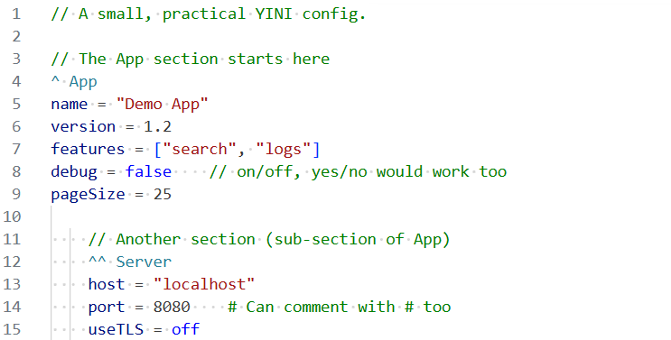
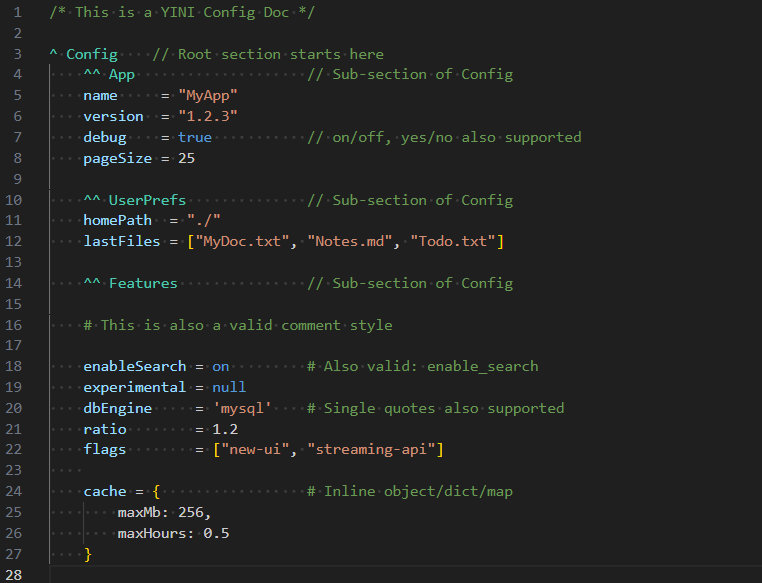

# YINI CLI

The official CLI for validating, inspecting, and converting YINI configuration files to JSON or JavaScript, maintained by the YINI-lang project.

YINI is an INI-inspired, human-readable configuration format with explicit structure, nested sections, comments, and predictable parsing.

YINI is intended to emphasize clarity, readability, explicit structure, predictability, and deterministic parsing, while remaining simple, but not simplistic.

[](https://www.npmjs.com/package/yini-cli) [](https://www.typescriptlang.org/) [](https://github.com/YINI-lang/yini-cli/actions/workflows/run-all-tests.yml) [](https://github.com/YINI-lang/yini-cli/actions/workflows/run-regression-tests.yml) [](https://github.com/YINI-lang/yini-cli/actions/workflows/run-cli-test.yml) [](https://www.npmjs.com/package/yini-cli)

## Quick Start

### Requirements
YINI CLI requires Node.js **v20 or later**.  

### Installation

1. **Install globally from npm — (requires Node.js)**  
    Open your terminal and run:
    ```
    npm install -g yini-cli
    ```

2. **Verify installation**  
    Run this in your terminal:
    ```bash
    yini --version
    ```
    This should print the installed version.

    Then try:
    ```bash
    yini --help
    ```
    This should show the CLI help.

3. **Test functionality**  
    Create a simple test file, for example: `config.yini`:
    ```yini
    ^ App
    name = "My App Title"
    version = "1.2.3"
    pageSize = 25
    darkTheme = off
    ```

    Then run:
    ```bash
    yini parse config.yini
    ```

    Expected output:
    ```json
    {
        "App": {
            "name": "My App Title",
            "version": "1.2.3",
            "pageSize": 25,
            "darkTheme": false
        }
    }    
    ```

### Typical use cases

- Validating configuration files during development or CI.
- Inspecting and debugging structured configuration.
- Converting YINI files to JSON for tooling and automation.

---

## What YINI looks like
> A basic YINI configuration example, showing a section, nested section, comments:  

Source: [basic.yini](./samples/basic.yini)

### A larger example
> A real-world YINI configuration example, showing sections, nesting, comments, and multiple data types:  

Source: [config.yini](./samples/config.yini)

---

## YINI characteristics
- **Indentation-independent structure:** YINI is indentation-independent — whitespace never alters structural meaning.
- **Explicit nesting:** Section markers such as `^`, `^^`, and `^^^` define hierarchy explicitly.
- **Multiple data types:** Supports booleans (`true` / `false`, `yes` / `no`, etc.), numbers, lists, and inline objects, with explicit string syntax.
- **Comment support:** YINI supports multiple comment styles (`#`, `//`, `/* ... */`, and `;`) for documenting configuration directly in the file.
- **Predictable parsing:** Well-defined rules with optional strict and lenient modes for different use cases.

---

## Usage

### Quick Examples

```bash
yini parse config.yini
```
→ Parse and print formatted JSON (default).

```bash
yini parse config.yini --compact
```
→ Output compact JSON (no whitespace).

```bash
yini parse config.yini --js
```
→ Output as JavaScript-style object.

```bash
yini parse config.yini -o out.json
```
→ Write formatted JSON to a file.

```bash
yini validate --strict config.yini
```
→ Validate using strict mode.

For help with a specific command:

```bash
yini parse --help
```

---

## A closer look at YINI

Here's a small example showing YINI structure and comments:
```yini
    // This is a comment in YINI

    ^ App                      // Defines section (group) "App" 
      name     = 'My Title'    // Keys and values are written as key = value
      items    = 25
      darkMode = true          // "ON" and "YES" works too

        // Sub-section of the "App" section
        ^^ Special
           primaryColor = #336699   // Hex number format
           isCaching    = false     // "OFF" and "NO" works too
    
    # This is a comment too.
```

**The above YINI as a JavaScript object:**
```js
{
    App: {
        name: 'My Title',
        items: 25,
        darkMode: true,
        Special: { 
            primaryColor: 3368601,
            isCaching: false
        }
    }
}
```

**In JSON:**
```json
{
   "App":{
      "name":"My Title",
      "items":25,
      "darkMode":true,
      "Special":{
         "primaryColor":3368601,
         "isCaching":false
      }
   }
}
```

- [YINI Homepage](https://yini-lang.org/?utm_source=github&utm_medium=referral&utm_campaign=yini_cli&utm_content=readme_middle).
- [YINI Demo Apps](https://github.com/YINI-lang/yini-demo-apps/tree/main) with usage examples.

---

## 📤 Output Modes for `yini parse`

The `parse` command supports multiple output formats:

| Command Example                         | Output Format       | Description |
|------------------------------------------|----------------------|------------|
| `yini parse config.yini`                | Pretty JSON (default) | Formatted JSON with indentation (4 spaces). |
| `yini parse config.yini --json`         | Pretty JSON          | Explicit pretty JSON output. |
| `yini parse config.yini --compact`      | Compact JSON         | Minified JSON (no whitespace). |
| `yini parse config.yini --js`           | JavaScript object    | JavaScript-style object (unquoted keys, single quotes). |
| `yini parse config.yini -o out.json`    | File output          | Writes formatted JSON to file (default format). |

> `--js` and `--compact` are mutually exclusive.  
> `--output` can be combined with a style flag to control both formatting and destination.

### Output File Handling

When using `-o, --output <file>`, YINI CLI applies safe write rules:

| Scenario | Result |
|----------|--------|
| File does not exist | File is written |
| File exists and is **older** than the input YINI file | File is overwritten |
| File exists and is **newer** than the input YINI file | Skipped by default |
| File exists and output content is unchanged | Skipped |
| `--overwrite` is used | File is always overwritten |
| `--no-overwrite` is used | Command fails if file exists |

This helps avoid overwriting newer generated files and avoids rewriting unchanged output unnecessarily.

Use `--overwrite` to force replacement.

---

## Links
- ➡️ [YINI Homepage](https://yini-lang.org)  
  *Tutorials, guides, and examples.*

- ➡️ [Read the YINI Specification](https://yini-lang.org/refs/specification)  
  *Full syntax and format reference.*

- ➡️ [YINI Parser on npm](https://www.npmjs.com/package/yini-parser)  
  *The TypeScript/Node.js parser used by this CLI.*

- ➡️ [Demo Apps](https://github.com/YINI-lang/yini-demo-apps/tree/main)  
  *Complete basic usage examples.*

- ➡️ [YINI-lang Project](https://github.com/YINI-lang)  
  *Repositories and related ecosystem projects.*

---

## Contributing
Bug reports, feedback, and contributions are welcome.  

GitHub Issues and Discussions are available for feedback and project discussion.

---

## License
This project is licensed under the Apache License 2.0 — see the [LICENSE](./LICENSE) file for details.

In this project on GitHub, the `libs` directory contains third-party software and each is licensed under its own license which is described in its own license file under the respective directory under `libs`.

---

**^YINI ≡**  
> YINI is a human-readable configuration format designed for clarity, readability, explicit structure, predictability, and deterministic parsing.
> 
> See the specification for syntax and format details.  

[yini-lang.org](https://yini-lang.org/?utm_source=github&utm_medium=referral&utm_campaign=yini_cli&utm_content=readme_footer) · [YINI-lang on GitHub](https://github.com/YINI-lang)  
